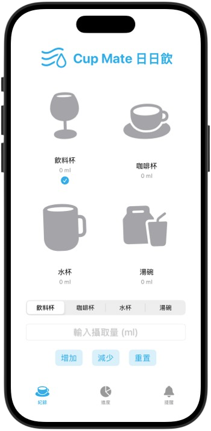
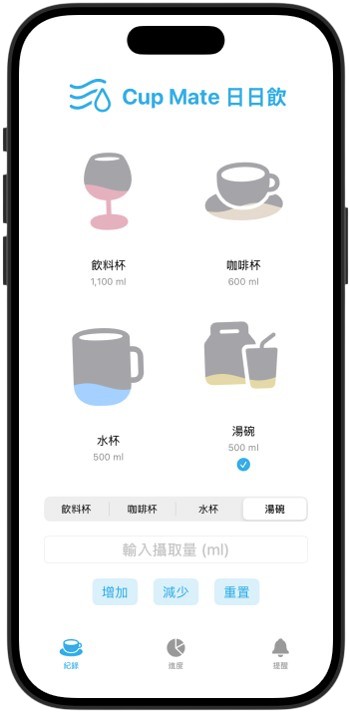
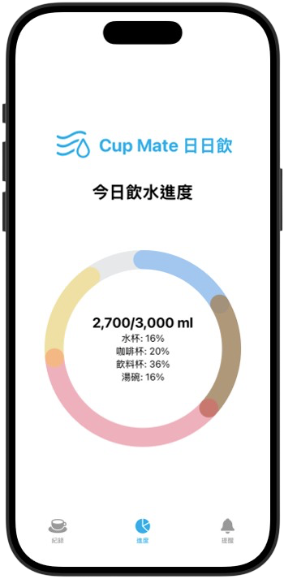

# 🧊 飲水記錄應用程式 (CupMate)

一個美觀且功能豐富的 iOS 飲水記錄應用程式，使用 SwiftUI 開發，具有動態水波動畫和杯子搖晃效果。

## ✨ 功能特色

### 🎯 核心功能
- **多類型飲品記錄**：支援飲料杯、咖啡杯、水杯、湯碗四種容器類型
- **即時攝取量統計**：自動計算當日總攝取量與目標進度
- **視覺化進度顯示**：直觀的水位顯示和進度追蹤
- **簡潔輸入介面**：分段控制器選擇 + 數字輸入的便捷操作
- **目標進度條**：以 ProgressView 呈現每日目標達成度
- **定時提醒**：可自訂喝水提醒，支援多種提示音與時段

### 🎨 視覺效果
- **動態水波動畫**：流暢的正弦波水面效果
- **杯子搖晃動畫**：添加攝取量時的逼真搖晃反饋
- **顏色主題區分**：每種飲品類型都有專屬的顏色識別
- **SF Symbols 圖示**：使用系統原生圖示，保持一致的視覺風格
- **進度圈**：動畫顯示整體進度

### 🔧 技術亮點
- **響應式網格佈局**：使用 `LazyVGrid` 實現 2x2 動態佈局
- **狀態管理**：高效的 `@State` 數據綁定和更新機制
- **自定義動畫**：結合 `onChange`、`withAnimation` 創造流暢的用戶體驗
- **形狀裁剪技術**：使用 `clipShape` 將水波限制在容器形狀內
- **形狀裁剪技術**：只要把水波動畫用 clipShape ( 或 mask )裁剪在杯子圖示形狀裡，WaveView 的顏色就只會填在杯子裡，不會填到外面。這就程式碼做到「加水時顏色只在杯子裡」的核心技術！
- **本地通知**：結合 UNUserNotificationCenter 實現喝水提醒

## 📱 畫面截圖






## 🏗️ 專案架構

```
project/
├── ContentView.swift     # 主要界面控制器
├── CupView.swift         # 個別杯子視圖組件
├── DrinkType.swift       # 飲品類型枚舉定義
├── WaveView.swift        # 水波動畫組件
├── ProgressView.swift    # 目標進度條元件
├── ReminderView.swift    # 喝水提醒頁與通知管理
└── README.md             # 專案說明文件
```

### 🔍 檔案說明

#### `ContentView.swift`
- **主控制器**：管理整個應用程式的狀態和界面
- **功能**：攝取量統計、用戶輸入處理、界面佈局
- **技術**：`@State` 狀態管理、`LazyVGrid` 響應式佈局

#### `CupView.swift`
- **杯子組件**：顯示單一飲品容器的狀態
- **功能**：水位顯示、搖晃動畫、數值標示
- **技術**：`onChange` 監聽、動畫序列、形狀裁剪

#### `DrinkType.swift`
- **類型系統**：定義飲品類型的屬性和特徵
- **功能**：顏色配置、圖示管理、容量設定
- **技術**：枚舉、計算屬性、協議實現

#### `WaveView.swift`
- **動畫引擎**：創造逼真的水波效果
- **功能**：正弦波計算、動態路徑繪製
- **技術**：`GeometryReader`、`Path`、數學函數

#### `ProgressView.swift`
- **進度條元件**：以視覺化方式呈現每日攝取目標完成度
- **功能**：根據攝取量比例動態更新進度
- **技術**：SwiftUI `ProgressView`、自訂樣式

#### `ReminderView.swift`
- **提醒功能頁面與通知管理**：設定喝水提醒時段、自訂訊息與音效
- **功能**：本地推播、工作區段設定、啟用/停用提醒、聲音選擇
- **技術**：UNUserNotificationCenter、SwiftUI 表單與清單、推播授權

## 🚀 開始使用

### 系統需求
- **iOS 15.0+**
- **Xcode 13.0+**
- **Swift 5.0+**

### 安裝步驟

1. **Clone專案**
   ```bash
   git clone https://github.com/yourusername/water-intake-tracker.git
   cd water-intake-tracker
   ```

2. **打開專案**
   ```bash
   open project.xcodeproj
   ```

3. **選擇目標設備**
   - 在 Xcode 中選擇 iOS 模擬器或實體設備

4. **運行應用程式**
   - 按下 `Cmd + R` 或點擊播放按鈕

### 使用說明

1. **選擇飲品類型**：使用頂部的分段控制器選擇要記錄的飲品
2. **輸入攝取量**：在輸入框中輸入攝取的毫升數
3. **點擊加入**：確認添加到對應的容器中
4. **查看進度**：觀察杯子的水位變化和總攝取量統計，並透過 ProgressView 查看目標完成度
5. **設定提醒**：進入 ReminderView，新增/調整喝水提醒時段、訊息與提示音
6. **享受動畫**：體驗流暢的水波和搖晃動畫效果

## 🎯 設計理念

### 用戶體驗
- **直觀操作**：最少點擊次數完成記錄
- **即時反饋**：動畫效果提供操作確認
- **視覺清晰**：顏色和圖示快速識別不同類型

### 技術原則
- **性能優化**：使用 `LazyVGrid` 和高效的狀態管理
- **代碼可讀性**：詳細註解和模組化架構
- **可擴展性**：枚舉設計便於添加新的飲品類型
